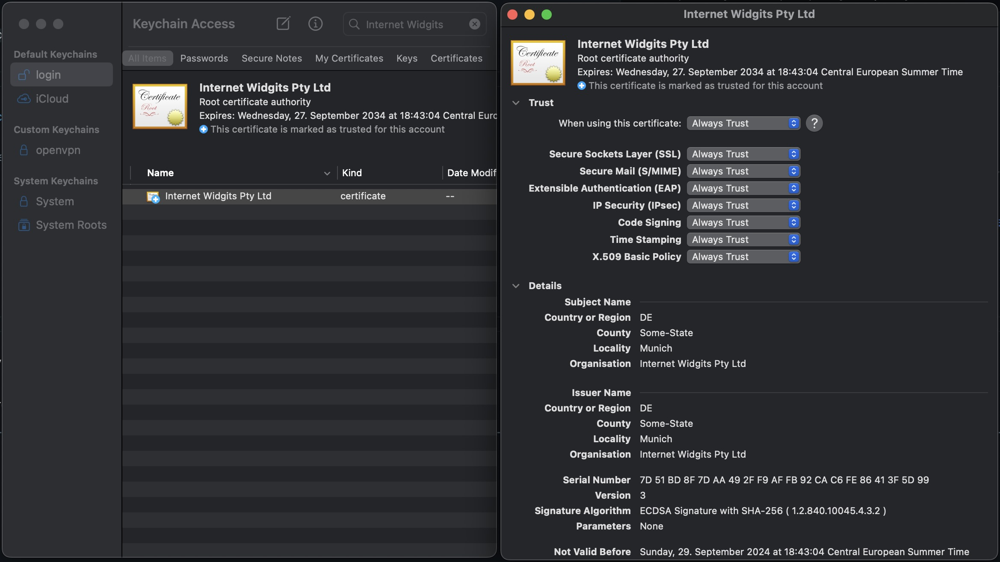

# Getting Started
Getting started with Open SPM Registry.
First we need to setup the server, then we can use it to publish and retrieve packages.

## Run server
In order to run the server we can either use the docker image or run it from source.
For sake of simplicity we will use the docker image here.

First we need to pull the image
```
docker pull wgr1984/openspmregistry:latest
```
then we can run it
```
docker run -p 8080:8080 -v ./:/data -i -t wgr1984/openspmregistry:latest
```
This will start the server on port 8080 and use the current directory as storage.
Now we can use the server to publish and retrieve packages.
To do so we need to setup the swift package manager to use the registry.

## Use SPM Registry
Since swift 5.3 we can use custom registries. Therefore, we need 2 projects.
One to publish a package and one to retrieve it.
Furthermore, we need to setup the registry in the swift package manager.

### Setup Registry
Ensure SPM registry is known and setup,
be aware `swift package-registry` as for now (Apple may change that in the future) accepts TlS/SSL se ured connections only
```
swift package-registry set https://localhost:8080
```
⚠️ on local setup (or any self-signed) we need to make sure ssl cert is set too trusted on system level:


### Create New Project to Publish
Simply create a new swift package library that we can publish.
```
> mkdir spm_test_lib
> cd spm_test_lib
> swift package init --type=library 
```
publish it to the registry
```
> swift package-registry publish test.TestLib 1.0.0
```

### Create New Project to Retrieve
Create a new swift package executable that uses the published package.
```
> mkdir spm_test
> cd spm_test
> swift package init --type=executable
```
add the dependency to the `Package.swift`
```swift
// swift-tools-version: 5.10
// The swift-tools-version declares the minimum version of Swift required to build this package.

import PackageDescription

let package = Package(
    name: "spm_test",
    
    // ==== add the dependency here ====
    dependencies: [
        .package(id: "test.TestLib", from: "1.0.0"),
    ],
    // ===================================
    
    targets: [
        // Targets are the basic building blocks of a package, defining a module or a test suite.
        // Targets can depend on other targets in this package and products from dependencies.
        .executableTarget(
            name: "spm_test",
            
            // ==== add the dependency here too ====
            dependencies: [
                .product(name: "spm_test_lib", package: "test.TestLib"),
            ]
            // =======================================
        ),
    ]
)
```
try to resolve the dependency
```
> swift package resolve     
Computing version for test.TestLib
Computed test.TestLib at 1.0.0 (0.50s)
Fetching test.TestLib from cache
Fetched test.TestLib from cache (0.00s)
```
Same can be done using Xcode of course:


And that's it. We have setup the server, published a package and retrieved it.

