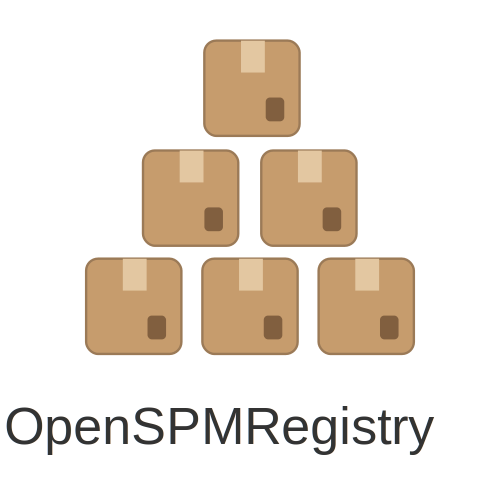

# About
Simple, fast and as feature complete as possible version
of [Swift Package Manager Registry](https://github.com/swiftlang/swift-package-manager/blob/main/Documentation/PackageRegistry/Registry.md){:target="_blank"}.
(at least in terms of API)

{: .fs-6 .fw-300 }

## Usage

- Getting started: [Click here]()
- Installation: [Click here]()
- Documentation: [Click here]()
- Docker Image: [Click here](https://hub.docker.com/r/wgr1984/openspmregistry){:target="_blank"}
- Source Code: [Click here](https://github.com/wgr1984/openspmregistry){:target="_blank"}
  
## Repository

Source code is available at 🔗 [https://github.com/wgr1984/openspmregistry](https://github.com/wgr1984/openspmregistry){:target="_blank"} check it out and contribute!

## Alternatives

There are other Swift Package Manager Registries available, e.g.:
- [Artifactory (Pro version required)](https://jfrog.com/artifactory/){:target="_blank"}
- [Gitea](https://docs.gitea.com/usage/packages/swift){:target="_blank"} / [Forgejo](https://forgejo.org/docs/latest/user/packages/swift/){:target="_blank"}
- [AWS CodeArtifact](https://aws.amazon.com/codeartifact/){:target="_blank"}

For sure these project are more general purpose projects and better suited for your needs.
This project is focused providing a microservice for Swift Package Manager Registry as lightweight as possible.
If this is what you are looking for, you are at the right place 🙂

## Contributing

Please feel free to contribute to this project. Just open issues, feature requests or pull requests.

## Donations

If you like this project and want to support me, [buy me a coffee](https://buymeacoffee.com/wreithmeiep){:target="_blank"} ☕️

