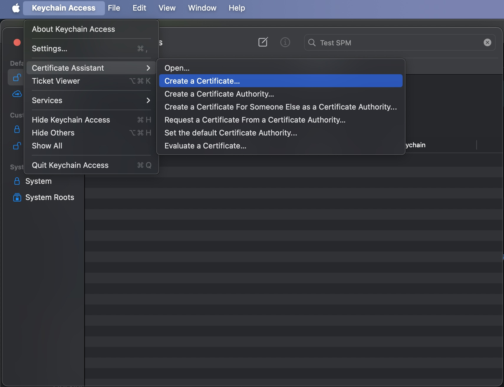
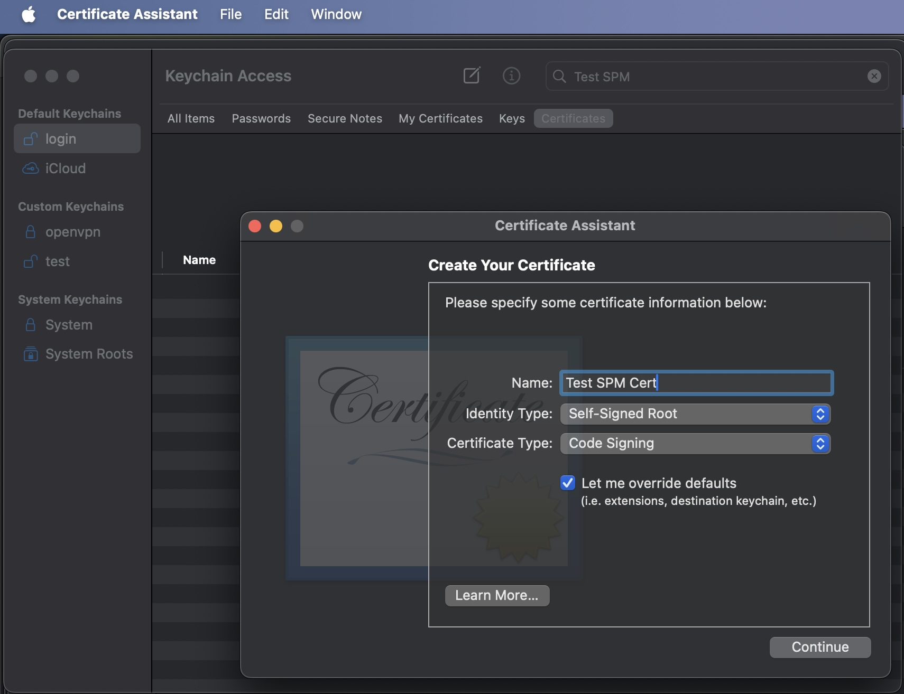

# Sign & create via Keychain_
_Create a self-signed certificate via Keychain_

## Create a Certificate
1. Open Keychain
2. Create new CA certificate


2a. Overright the default settings

2b. Change Key Pair Information to ECC and 256 bits


2c. Ensure Code Signing is enabled

3. Save it to keychain

## Sign a Package & Publish
```shell
swift package-registry publish [scope].[Package] [version] \
      --metadata-path package-metadata.json \
      --signing-identity "Test SPM Cert" \
      --vv
```
