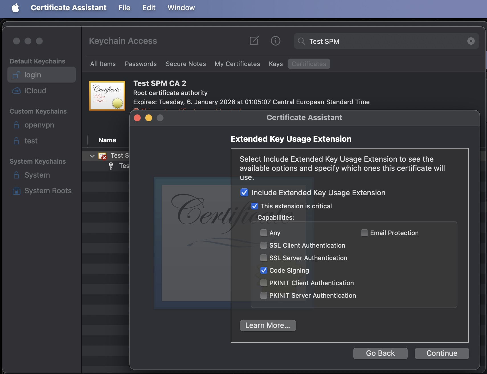

# Sign & create via Keychain_
Create a self-signed certificate via Keychain

### Create a Certificate
1. Open keychain
2. Go to Certificate Assistant > Create a Certificate Authority


3. Go to Certificate Assistant > Create a Certificate
3.a. Overwrite the default settings (leaf, code signing)

3.b. Choose previously created CA

3.c. Change Key Pair Information to ECC and 256 bits

3.d. Ensure Code Signing is enabled

4. Save it to keychain

### Add CA to trusted root
1. Export the CA

2. Save in as CER in the trusted root dir: `~/.swiftpm/security/trusted-root-certs/`

### Sign a Package & Publish
```shell
swift package-registry publish [scope].[Package] [version] \
      --metadata-path package-metadata.json \
      --signing-identity "Test SPM Cert" \
      --vv
```
